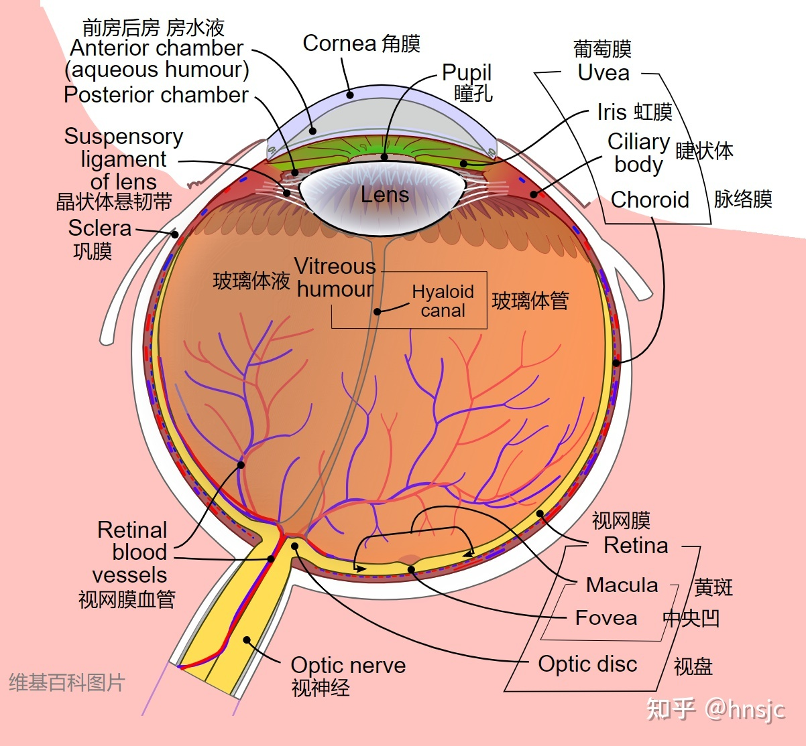

# Chapter 2 数字图像基础

2023-04-22

## 1.视觉感知要素

### 1.1人眼

锥状体：600-700万个 对颜色高度敏感 辨别细节 称为**白昼视觉或亮视觉**
杆状体：7500-15000万个 没有色彩感知  称为**暗视觉或微光视觉**

## 光和电磁波

单色光或无色光：没有颜色的光
唯一属性是其强度（大小）
灰度级 通常用来表示单色光的强度

## 简单的图像形成模型

$$ f(x,y)= i(x,y)r(x,y) $$

式中，
入射分量$`0 < i(x,y) < \infty`$，反射分量$`0 < r(x,y) < 1`$

入射分量$`i`$取决于照射源
反射分量$`r`$限制在全吸收(0)和全反射(0)之间，取决于成像物体的特性
令单色图像在任何坐标$`(x_0,y_0)`$处的强度（灰度）表示为

$$ l=f(x_0,y_0)$$

$`l`$取 $`0`$ ~ $`L-1`$  
$`L`$常取$`2^k`$

## 取样与量化

**取样：对坐标数值化**
**量化：对幅值数字化**

数字图像的质量很大程度上取决于**样本数**和**灰度级**

一幅图像常用灰度图、二维矩阵表示

灰度的上限取决于<mark>饱和度</mark>，下限取决于<mark>噪声</mark>
最大灰度与最小灰度之差定义为<mark>对比度</mark>

存储数字图像所需的比特数b为

$$ b=M * N * k $$

空间和灰度的分辨率

* **空间分辨率** 单位距离的线对数和单位距离的点数（像素数），单位为$`dpi`$
* **灰度分辨率** 灰度级中可分辨的最小变化，单位 比特（即量化灰度的比特数）
灰度级数不足会出现伪轮廓

图像内插

* 最近邻内插
* 双线性内插
* 双三次内插

## 像素间的一些基本关系

**4邻域**对于$`(x,y)：(x-1,y),(x+1,y),(x,y-1),(x,y+1)`$，记为$`N_4(p)`$
**4对角邻域**：$`(x+1,y+1),(x+1,y-1),(x-1,y-1),(x-1,y+1)`$，记为$`N_D(p)`$
其上统称为**8邻域**，记为$`N_8(p)`$

<mark>邻接</mark>
？？？

### 距离度量

$D_4(p,q) =|x-s|+|y-t|$,即一个菱形区域，当$`D_4=1`$时，即为4邻域
$D_8(p,q) =max(|x-s|,|y-t|)$,即一个菱形区域，当$`D_8=1`$时，即为8邻域

### 运算

阵列相乘：每一位数乘

* \+ ：相加取平均，可以对同一幅图像多次累加取平均，用来去除加性噪声 类似手机拍摄夜景
* \-  ：增强图像差别
* x   ：矫正阴影， 挑选出ROI
* \/  ：矫正阴影
矩阵相乘：矩阵运算

集合运算
$`A^c`$：表示补集
$`A=\{(x,y,x)\}`$，则$`A^c=\{(x,y,K-z)|(x,y,x)\in A \}`$

逻辑运算
同理……

<mark>模糊集合</mark>
隶属度函数
eg. 一个人的年轻度为50%

### 空间操作

* 单像素操作
    灰度变换
* 邻域操作
    模糊$`g(x,y)=1/mn*\sum_{(r,c)\in S_{xy}}f(r,c)`$
* 几何空间变换和图像配准
    几何变换：空间变换+灰度内插
    尺度，旋转，平移，偏移变换
    ……

    图像配准
    寻找约束点，建立两幅图像的空间变换关系式

* 图像变换
    在变换域处理图像，在反变换回去
